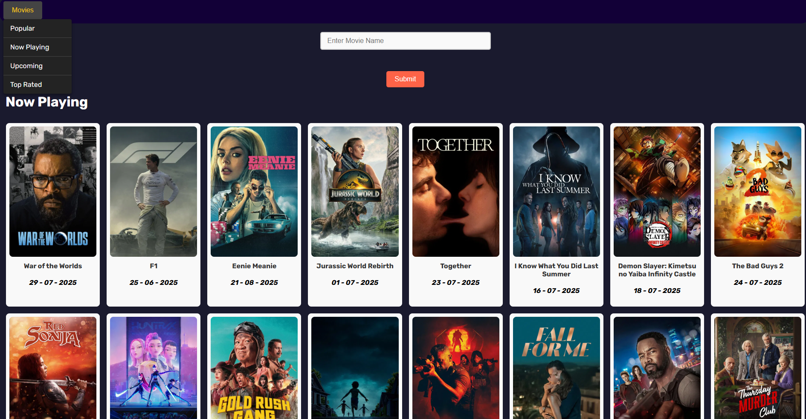
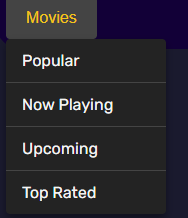
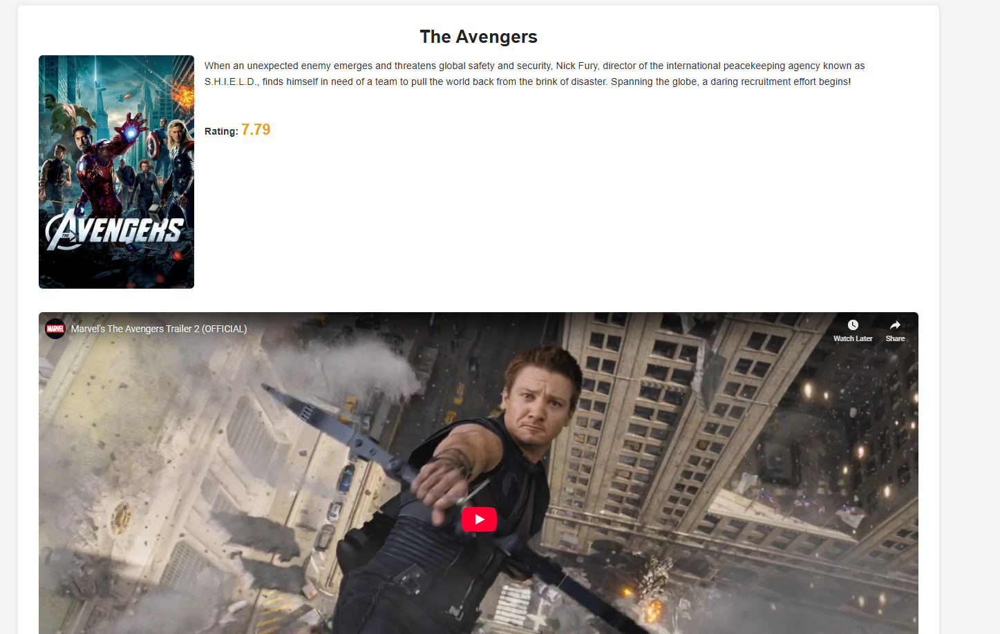

# 🎬 Movie Explorer

Movie Explorer is a JavaScript web application powered by [The Movie Database (TMDb) API](https://www.themoviedb.org/). It allows users to browse and search for movies in different categories, such as *Now Playing*, *Upcoming*, *Top Rated*, and *Popular*. The app dynamically fetches data and updates the UI without page refreshes.

🔗 [Live Demo](https://adeelh12.github.io/Movie_Website/index.html)  
📂 [GitHub Repo](https://github.com/AdeelH12/Movie_Website/)

---

## ✨ Features

- 🏠 **Home Page**: Displays movies currently playing in cinemas.  
- 🔍 **Search**: Search movies by title with instant API results.  
- 🎞️ **Categories**: Navigate between *Now Playing*, *Upcoming*, *Top Rated*, and *Popular*.
- 🎬 **Movie Details**: Click on a movie to view synopsis, rating, and trailer. 
- ⚡ **Dynamic Updates**: Content refreshes dynamically using `fetch`, without full page reloads.  
- 📱 **Responsive Design**: Works seamlessly across desktop and mobile.  

---

## 🛠️ Tech Stack

- **Frontend**: HTML5, CSS3, JavaScript (Vanilla JS)  
- **API**: [TMDb API](https://developers.themoviedb.org/3)  
- **Methods**: `fetch`, DOM manipulation  

---

## 📸 Screenshots

### 🏠 Home (Now Playing)


### 🔍 Search Results


### 🎞️ Categories


### 🎬 Movie Details

---

## 🔮 Future Improvements

- Add movie details page (synopsis, cast, trailer).
- Implement favourites/watchlist with localStorage.
- Add pagination or infinite scroll for long lists.
- Improve UI/UX with a modern styling framework (Tailwind CSS / Bootstrap).
- Display movie posters & ratings more prominently.
  
## 📚 What I Learned

- Fetching and displaying data from the TMDb API.
- Using fetch with dynamic query parameters.
- Updating the DOM dynamically without page reloads.
- Handling user input through a search form.
- Designing a responsive, movie-focused UI.
  
## 🚀 Getting Started

Clone the repository and open `index.html` in your browser:

```bash
git clone https://github.com/AdeelH12/Movie_Website.git
cd Movie_Website
```
